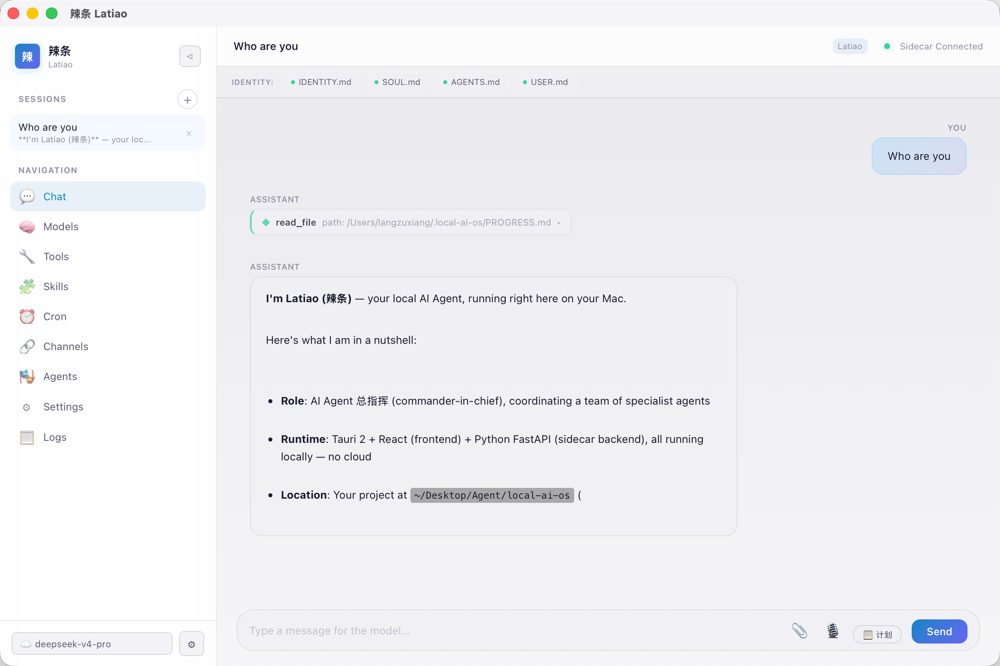

# 🌶️ Latiao — 你的本地 AI Agent 桌面应用

> **跑在你本机上的 AI Agent。不需要联网，不偷你的代码，用你自己的模型。**

[](LICENSE)
[](https://tauri.app)
[](https://python.org)

Latiao（辣条）是一个桌面 AI Agent 应用，基于 Tauri + React + Python FastAPI 构建。它能在你的电脑上自主执行任务——读取文件、执行命令、搜索代码、管理项目，所有数据和代码都在本地，完全隐私。

<p align="center">
  
</p>

## ✨ 核心特性

- 🏠 **完全本地** — Agent 逻辑跑在本机，不需要云服务
- 🧠 **多模型** — 本地模型（MLX / llama.cpp）+ 云端 API（OpenAI / DeepSeek / Anthropic）
- 🔧 **工具系统** — 读文件、执行命令、搜索代码、打开应用
- 🎭 **多 Agent** — 内置代码审查、调试、文档生成、翻译
- 🧩 **技能系统** — 可扩展的 SKILL.md 插件，按需加载领域知识
- 💾 **记忆系统** — SQLite + TF-IDF 语义搜索，跨会话持久化
- ✅ **自验证** — 文件回读、ESLint、Python 语法、TypeScript 类型检查
- ⏰ **定时任务** — Cron 风格定时自动化
- 🌐 **多语言** — English / 中文 / 日本語 / Русский

## 📥 下载安装（macOS）

> ⚠️ **仅支持 Apple Silicon Mac（M1/M2/M3/M4）**。Intel Mac 和 Windows 暂不支持。

从 [GitHub Releases](https://github.com/RenYiX0620/Latiao/releases) 下载最新版 `Latiao_*.dmg`：

1. 双击 `.dmg` 挂载
2. 把 `Latiao.app` 拖进 `Applications` 文件夹
3. 双击打开

**不需要装 Python、Node.js 或任何其他依赖。下载即用。**

## 🚀 开发者指南

如果你要从源码构建和开发 Latiao：

### 环境要求

- macOS（Apple Silicon）
- Node.js 20+
- Python 3.10+
- Rust 工具链

### 本地开发

```bash
git clone https://github.com/RenYiX0620/Latiao.git
cd Latiao

# 前端依赖
npm install

# Python 环境
cd sidecar
python3 -m venv venv
source venv/bin/activate
pip install -r requirements.txt
cd ..

# 启动开发模式
npm run tauri dev
```

### 生产构建

```bash
# 一键构建（下载便携 Python + 打包 .app + 复制到桌面）
npm run deploy
```

构建产物：
- `.app` → `src-tauri/target/release/bundle/macos/Latiao.app`
- `.dmg` → `src-tauri/target/release/bundle/dmg/Latiao_*.dmg`

### 发布新版本

```bash
npm run release -- 0.2.0
```

## 🏗️ 架构

```
┌─────────────────────────────────────┐
│  Tauri 桌面应用 (Rust + React)       │
│  ┌───────────┐  ┌──────────────────┐ │
│  │   前端 UI   │  │  Tauri Commands  │ │
│  │ (React 19) │  │   (Rust)         │ │
│  └─────┬─────┘  └────────┬─────────┘ │
│        │                  │           │
└────────┼──────────────────┼───────────┘
         │                  │
         ▼                  ▼
┌─────────────────────────────────────┐
│  Python Sidecar (FastAPI)           │
│  ┌──────────────────────────────┐   │
│  │      Agent Loop              │   │
│  │  ├─ 流式 SSE 输出             │   │
│  │  ├─ 工具执行 + 权限控制        │   │
│  │  ├─ 自验证闭环                │   │
│  │  └─ 记忆系统 (SQLite)         │   │
│  ├──────────────────────────────┤   │
│  │  Local LLM Engine            │   │
│  │  ├─ MLX / llama.cpp          │   │
│  │  └─ 模型下载与管理             │   │
│  └──────────────────────────────┘   │
└─────────────────────────────────────┘
```

## 🧩 技能系统

每个 skill 是一个 SKILL.md 文件，放在 `sidecar/skills/` 目录。

### 内置技能

| 技能 | 描述 |
|------|------|
| `code-review` | 代码审查与安全分析 |
| `git-workflow` | Git 工作流规范 |
| `python-fastapi` | Python FastAPI 最佳实践 |
| `typescript-react` | TypeScript React 开发规范 |

### 创建自定义技能

```markdown
# sidecar/skills/my-skill.md
---
name: my-skill
description: 描述你的技能
---

## 规则
1. 第一条规则
2. 第二条规则

## 退出标准
- 必须满足的条件
```

## 📄 许可

MIT License — 自由使用、修改、分发。
