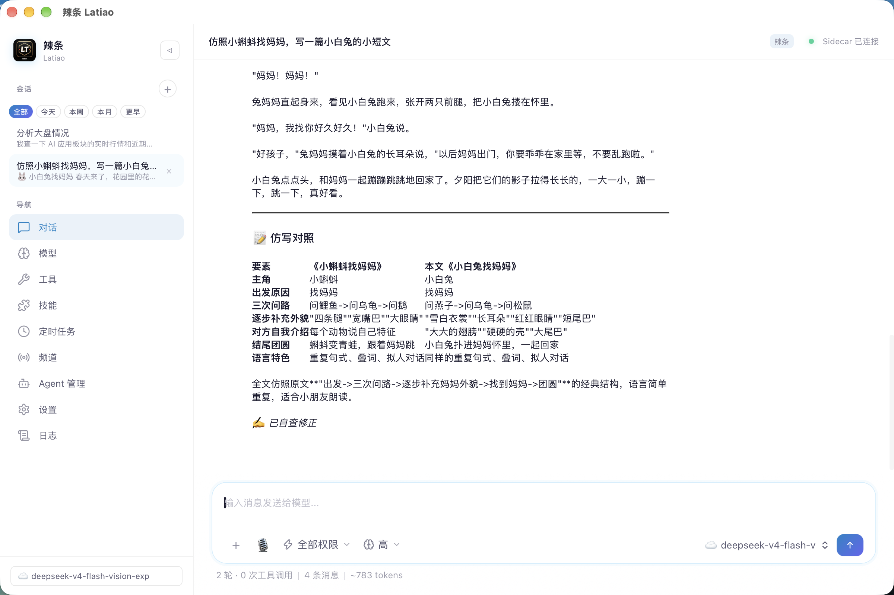

> **中文** | [English](README.md)


<p align="center">
  
</p>

<p align="center">
  <a href="LICENSE"></a>
  <a href="https://tauri.app"></a>
  <a href="https://python.org"></a>
  
  <a href="https://github.com/RenYiX0620/Latiao/releases"></a>
  <a href="https://github.com/RenYiX0620/Latiao/releases"></a>
  <a href="https://github.com/RenYiX0620/Latiao/discussions"></a>
</p>

---

# 🌶️ 辣条 Latiao — 你的本地 AI 智能助手

> **跑在你电脑上的 AI 助手（macOS / Windows）。不上传数据、不偷代码、用你自己的模型、听你自己的规则。**

辣条（Latiao）是一个桌面 AI Agent 应用，基于 Tauri + React + Python FastAPI 构建。它能像人一样在你的电脑上自主工作——**读写文件、执行命令、联网搜索、查询行情、调度子智能体、定时干活**，所有数据都在本地，完全隐私。

## 它能做什么？

| 能力 | 说明 |
|------|------|
| 📂 **文件操作** | 读取、写入、搜索、管理你文件系统中的文件 |
| 💻 **命令执行** | 运行 Shell 命令、脚本、开发工具链 |
| 🌐 **联网搜索** | Tavily（LLM 优化）+ 必应抓取，实时新闻/文档/事实查询 |
| 📈 **金融行情** | A股/港股/基金行情、主力资金、财务指标（东方财富数据） |
| 🧠 **多模型** | 本地模型（MLX / llama.cpp）或云端 API（OpenAI / DeepSeek / Anthropic）自由切换 |
| 🤖 **子智能体** | 委派专家子任务——探索者、代码审查员、调试专家、文档生成器、翻译助手；后台运行，活动栏实时看进度 |
| 🧩 **技能与插件** | SKILL.md 知识包 + 可编辑 Python 插件（你的修改跨版本保留） |
| 💾 **持久记忆** | SQLite + TF-IDF 语义搜索，跨会话记住你的偏好和上下文 |
| ✅ **自验证** | 自动检查自己的工作（回读文件、ESLint、Python 语法、TS 类型检查） |
| ⏰ **定时任务** | Cron 风格定时自动化，重启后自动补跑错过的任务 |
| 🛡️ **五级权限** | read_only / confirm / auto_edit / plan / full——自主权你说了算 |
| 🌐 **多语言** | 界面支持 English / 中文 / 日本語 / Русский |

## 它是怎么工作的？

```
你："帮我把 src/ 里所有 lint 错误修了"      辣条：
                                              ├─ 逐个读取 src/ 下的文件
                                              ├─ 对每个文件运行 ESLint
                                              ├─ 自动应用修复
                                              ├─ 重新运行 ESLint 确认
                                              ├─ 汇报："已修复 5 个文件共 12 个错误 ✅"
                                              └── 重的搜索活儿可以派后台探索者子智能体，
                                                  时间线里实时看它干活
```

Agent 通过 SSE 实时流式输出思考和执行过程——思考行、工具耗时、类别聚合（"探索 · 3 次搜索"）渲染成 ZCode 风格时间线。敏感操作（写文件、执行命令）先征求确认，你始终拥有最终控制权。

## 📥 下载安装（macOS / Windows）

| 平台 | 要求 | 下载 |
|------|------|------|
| **macOS（Apple Silicon）** | M1–M4 | `Latiao_*.aarch64.dmg` |
| **Windows（x64）** | Win10+ | `Latiao_*_x64-setup.exe` / `.msi` |

从 [GitHub Releases](https://github.com/RenYiX0620/Latiao/releases) 下载最新版；国内用户推荐 [Gitee Releases](https://gitee.com/ryxo00/Latiao/releases) 镜像（下载快得多）。

- **macOS**：双击 `.dmg`，拖 `Latiao.app` 进应用程序。未签名应用被拦时：右键 → 打开。
- **Windows**：运行 `setup.exe` 安装。SmartScreen 提示时选"更多信息 → 仍要运行"。

**不需要装 Python、Node.js 或任何依赖。下载即用。**

### 🔄 自动更新

应用内自动更新——后台静默预下载（断点续传、跨重启），确认后一键安装重启。设置页也可随时手动"检查更新"。

### 📈 金融数据（内置免费链）

三层免费兜底，前两层无需任何 API Key：

1. **mx_query** — 东方财富结构化数据（指数/板块/个股行情、主力资金、财务指标），免费额度 150 次/天；
2. **ak_finance** — AKShare 公开数据（无限次、免 Key），指数/个股行情；
3. **tavily_search / bing_search** — 联网搜索兜底（新闻、境外市场、板块排行）。

每日额度用完时 Agent 自动降级到下一层，不中断。

### 🧠 本地模型兼容性提示

- 开箱即用：MLX 模型（4/6/8bit）、GGUF 模型（llama.cpp 引擎），包括 LM Studio 的目录式布局（`模型.gguf/模型.gguf`）；
- 过新的模型架构可能不被内置引擎支持（如 `muse_glimmer` 这类最新架构还没进 mlx-lm 正式版）——建议选主流模型（Qwen/Ornith/GLM 等），或让这类模型留在 LM Studio 里通过外部引擎使用。

## 🤖 子智能体

复杂任务会被拆分。主 Agent 可将子任务委派给专家子智能体——每个有独立的工具白名单和身份：

| 子智能体 | 工具 | 擅长 |
|---------|------|------|
| **探索者** | 文件 + 只读命令白名单 + 联网搜索 | 摸清代码结构、调研、查资料 |
| **代码审查员** | 只读文件 | 安全与质量审查 |
| **调试专家** | 文件 + 白名单命令 | 日志分析、Bug 定位 |
| **文档生成器** | 文件 + 写入 | README/API 文档/变更日志 |
| **翻译助手** | 文件 + 写入 | 多语言与本地化 |

指定 `background: true` 后台运行，步骤数、执行的命令、读写的文件实时流入活动栏，完成后结果自动回到对话。

## 🧩 技能与插件

**技能**是按需加载的 `SKILL.md` 知识包：

| 技能 | 教给 Agent 什么 |
|------|----------------|
| `multi-search` | 多引擎联网搜索策略 |
| `mx-data` | 金融数据查询模式（东方财富） |
| `runcmd-patterns` | 安全的 Shell 命令模式 |

把 `SKILL.md` 放进 `sidecar/skills/` 即自动识别。

**插件**是 `sidecar/plugins/` 下的可编辑 Python 工具——read_file、run_cmd、tavily_search、bing_search、mx_query 等。每个插件是暴露 `NAME`、`DEFINITION`、`execute()` 的单文件。应用更新不会覆盖你的修改（基于哈希的 seed manifest 追踪）。

## 🚀 开发者指南

### 环境要求

- macOS（Apple Silicon）
- Node.js 20+
- Python 3.10+
- Rust 工具链

### 本地开发

```bash
git clone https://github.com/RenYiX0620/Latiao.git
cd Latiao
npm install
cd sidecar && python3 -m venv venv && source venv/bin/activate && pip install -r requirements.txt && cd ..
npm run tauri dev
```

### 生产构建

```bash
npm run deploy
```

一键加固构建：清缓存 → 便携 Python → 逐文件资源校验 → 打包。

产物：
- `Latiao.app` → `src-tauri/target/release/bundle/macos/`
- `Latiao_*.dmg` → `src-tauri/target/release/bundle/dmg/`

### 运行测试

```bash
cd sidecar && python -m pytest tests/ -q
```

## 🏗️ 架构

```
┌──────────────────────────────────────────┐
│         Tauri 桌面壳                      │
│  ┌────────────┐  ┌────────────────────┐   │
│  │  React 19  │  │  Rust 后端          │   │
│  │  (界面)    │  │  (命令路由、代理)    │   │
│  └─────┬──────┘  └─────────┬──────────┘   │
└────────┼───────────────────┼──────────────┘
         ▼                   ▼
┌──────────────────────────────────────────┐
│     Python Sidecar (FastAPI + SSE)        │
│  ┌────────────────────────────────────┐   │
│  │        Agent 主循环                │   │
│  │  ├─ SSE 流式 + 看门狗              │   │
│  │  ├─ 工具调用（原生 + prompt 式）    │   │
│  │  ├─ 五级权限系统                   │   │
│  │  ├─ 子智能体编排                   │   │
│  │  ├─ 自验证管线                     │   │
│  │  └─ 记忆存储 (SQLite)              │   │
│  ├────────────────────────────────────┤   │
│  │      本地 LLM 引擎                 │   │
│  │  ├─ MLX（Apple Silicon 原生）      │   │
│  │  ├─ llama.cpp                      │   │
│  │  └─ 自动重载与崩溃恢复              │   │
│  └────────────────────────────────────┘   │
└──────────────────────────────────────────┘
```

## 🔄 如何更新

**v0.3.3 及以后版本（全自动）**：应用启动时自动检查更新，或打开"设置 → 检查更新"。发现新版本 → 确认 → 下载（显示进度）→ 安装并自动重启。

**0.3.1 及更早版本（需手动升级一次）**：旧版本内置旧签名公钥，而旧私钥密码已丢失，无法再为旧版本签发有效更新包，因此无法应用内在线升级。请在 [Releases](https://github.com/RenYiX0620/Latiao/releases/latest) 页面手动下载并安装最新版本（Windows 运行 `*-setup.exe`；macOS 打开 DMG 拖入"应用程序"），之后即可全自动更新。安装只替换应用本体：模型（`~/Models`、`~/.cache/huggingface`）、聊天记录与设置均保留。

## 📄 许可

MIT — 自由使用、修改和分发。
